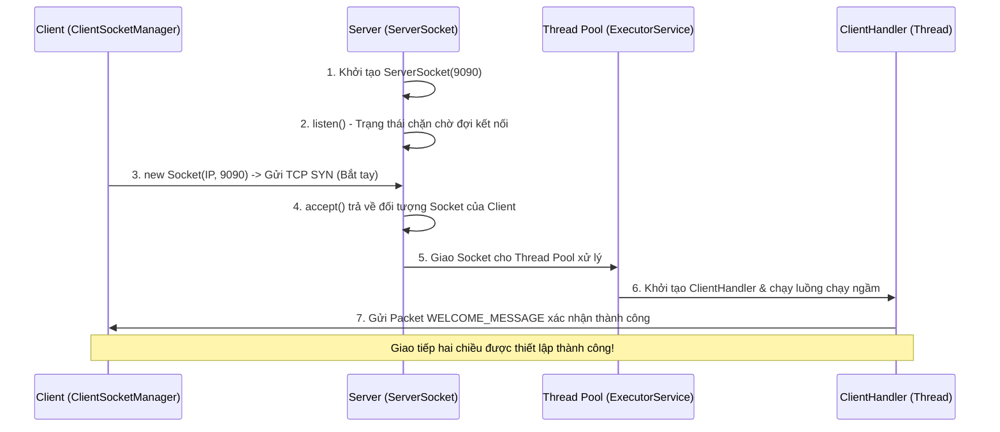
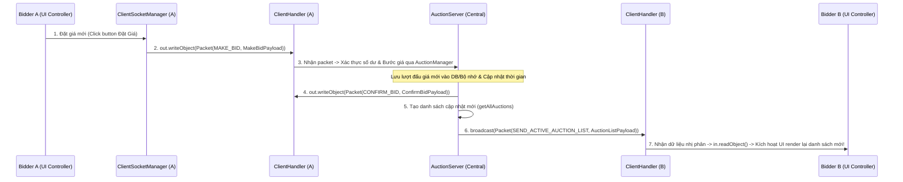

# HƯỚNG DẪN CHI TIẾT KIẾN TRÚC VÀ CÁCH KHỞI CHẠY CLIENT - SOCKET

Tài liệu này tổng hợp toàn bộ kiến thức chuyên sâu về **Kiến trúc hoạt động của Client - Socket** và **Quy trình các bước khởi chạy hệ thống** thực tế trong dự án Đấu giá Java (`Auction-System-in-Java`).

---

## PHẦN I: KIẾN TRÚC HOẠT ĐỘNG CHI TIẾT CỦA CLIENT - SOCKET

### 1. Khái Niệm Cơ Bản Về Socket & TCP/IP

**Socket** (Điểm cuối kết nối) là một trừu tượng hóa phần mềm (Software Abstraction) đóng vai trò là cổng giao tiếp giữa các tiến trình chạy trên cùng một máy tính hoặc trên các máy tính khác nhau qua mạng. 

Một kết nối mạng được định nghĩa bởi một **Socket Pair** gồm:
$$\text{Connection} = (\text{Client IP}, \text{Client Port}, \text{Server IP}, \text{Server Port})$$

*   **IP Address**: Xác định thiết bị vật lý trong mạng.
*   **Port**: Xác định tiến trình (Process) cụ thể chạy trên thiết bị đó (ví dụ: Port `9090` dành cho Auction Server).

> [!NOTE]
> Hệ thống đấu giá của chúng ta sử dụng giao thức **TCP (Transmission Control Protocol)**. TCP đảm bảo dữ liệu truyền đi tin cậy, đúng thứ tự, không bị thất thoát thông qua cơ chế bắt tay 3 bước (3-way handshake) và kiểm soát luồng (Flow Control).

---

### 2. Quy Trình Khởi Tạo & Kết Nối (Connection Lifecycle)

Kiến trúc Client - Server Socket hoạt động theo mô hình bất đối xứng (Asymmetric), trong đó Server luôn ở trạng thái chủ động chờ đợi, còn Client là bên chủ động yêu cầu kết nối.

#### Mô hình tuần tự kết nối:



---

### 3. Kiến Trúc Phía Server (Multithreaded Server)

Phía Server phải có khả năng xử lý **hàng trăm hoặc hàng nghìn Client đồng thời**. Nếu Server xử lý tuần tự từng client trên một luồng chính duy nhất, kết nối của các client sau sẽ bị nghẽn (Blocking).

Hệ thống của chúng ta giải quyết vấn đề này bằng cách kết hợp **ServerSocket**, **Thread Pool (`ExecutorService`)** và **ClientHandler**.

#### A. Lắng nghe và Phân phối Kết nối (`AuctionServer.java`)
Trong file [AuctionServer.java](file:///c:/Users/Admin/Downloads/Auctionabcx/Auction-System-in-Java/Source/src/main/java/server/network/AuctionServer.java#L98-L115), luồng hoạt động diễn ra như sau:

```java
public void listen() throws IOException {
    isAcceptingAuctions = true;
    isListening = true;
    System.out.println("[Server] Đang lắng nghe kết nối...");

    while (isListening) {
        // 1. Chặn (Block) tại đây cho đến khi có một client kết nối tới cổng 9090
        Socket clientSocket = serverSocket.accept();
        
        // 2. Bọc socket trong đối tượng AuctionClient đại diện cho thông tin client
        AuctionClient client = new AuctionClient(clientSocket);
        
        // 3. Khởi tạo một Handler chuyên biệt để giao tiếp với client này
        ClientHandler clientThread = new ClientHandler(client);
        
        // 4. Lưu trữ Handler vào HashMap để quản lý trạng thái, gửi tin broadcast
        String clientKey = clientSocket.getInetAddress().getHostAddress() + ":" + clientSocket.getPort();
        clientHandlers.put(clientKey, clientThread);
        
        // 5. Đẩy Handler vào Thread Pool để thực thi không đồng bộ (Asynchronous)
        pool.execute(clientThread);
        System.out.println("[Server] Client mới kết nối: " + clientKey);
    }
}
```

#### B. Xử lý logic độc lập của Client (`ClientHandler.java`)
Mỗi client kết nối tới server sẽ có riêng một luồng `ClientHandler` chạy ngầm để đọc và ghi dữ liệu. 

Như trong [ClientHandler.java](file:///c:/Users/Admin/Downloads/Auctionabcx/Auction-System-in-Java/Source/src/main/java/server/network/ClientHandler.java#L72-L100):
1.  **Thiết lập Stream**: Tạo `ObjectInputStream` để đọc dữ liệu và `ObjectOutputStream` để gửi dữ liệu dạng Object đã được tuần tự hóa (Serialization).
2.  **Vòng lặp Sự kiện (Event Loop)**:
    ```java
    public void clienthandler(){
     while (isRunning) {
        // 1. Đọc gói tin gửi từ Client (Hành động chặn/Block cho đến khi có tin nhắn)
        PacketMessage packetMessage = (PacketMessage) objectInputStream.readObject();

        // 2. Phân loại tin nhắn dựa trên MessageType
        switch (packetMessage.getType()) {
            case LOGIN:
                handleLogin((LoginPayload) packetMessage.getPayload());
                break;
            case MAKE_BID:
                makeBid(packetMessage);
                break;
            case REQUEST_ACTIVE_AUCTION_LIST:
                sendAllAuctions();
                break;
            // ... các trường hợp khác
        }
    }}
    ```

---

### 4. Kiến Trúc Phía Client (Event-Driven & Singleton)

Phía Client cần giải quyết hai vấn đề lớn:
1.  **Chỉ có một kết nối duy nhất** đến Server trong suốt vòng đời ứng dụng (Tránh lãng phí tài nguyên).
2.  **Lắng nghe tin nhắn từ Server theo thời gian thực** mà không làm đơ (Freezing) giao diện đồ họa (JavaFX Thread).

Giải pháp trong [ClientSocketManager.java](file:///c:/Users/Admin/Downloads/Auctionabcx/Auction-System-in-Java/Source/src/main/java/client/network/ClientSocketManager.java) bao gồm:

#### A. Mẫu Thiết Kế Singleton (Đảm bảo duy nhất)
Đảm bảo toàn bộ ứng dụng Client chỉ sử dụng duy nhất một luồng kết nối TCP thông qua biến tĩnh và cơ chế đồng bộ hóa:
```java
private static volatile ClientSocketManager instance;

public static ClientSocketManager getInstance() {
    if (instance == null) {
        synchronized (ClientSocketManager.class) {
            if (instance == null) {
                instance = new ClientSocketManager();
            }
        }
    }
    return instance;
}
```

#### B. Luồng Lắng Nghe Ngầm (Daemon Thread)
Để tránh khóa luồng UI khi gọi phương thức chặn `in.readObject()`, client khởi tạo một Daemon Thread chạy song song:
```java
private void startListener() {
    listenerThread = new Thread(() -> {
        try {
            while (isRunning) {
                // Đọc gói tin từ server (Chặn cho đến khi server gửi gói tin mới)
                Object obj = in.readObject();
                if (obj instanceof PacketMessage) {
                    PacketMessage msg = (PacketMessage) obj;
                    
                    // Phát sự kiện đến tất cả các Controller đang đăng ký lắng nghe
                    for (Consumer<PacketMessage> listener : listeners) {
                        listener.accept(msg);
                    }
                }
            }
        } catch (Exception e) {
            if (isRunning) {
                System.err.println("[Client] Mất kết nối tới Server: " + e.getMessage());
                disconnect();
            }
        }
    });
    listenerThread.setDaemon(true); // Tự động tắt luồng này khi ứng dụng chính đóng
    listenerThread.start();
}
```

#### C. Mẫu Thiết Kế Observer (Đăng ký nhận tin thời gian thực)
Các giao diện Controller (như màn hình đấu giá, màn hình đăng nhập) chỉ cần đăng ký Listener để nhận cập nhật tự động mà không cần can thiệp sâu vào Socket vật lý:
```java
// Đăng ký nhận tin nhắn
public void addMessageListener(Consumer<PacketMessage> listener) {
    listeners.add(listener);
}

// Hủy đăng ký khi đóng màn hình
public void removeMessageListener(Consumer<PacketMessage> listener) {
    listeners.remove(listener);
}
```

> [!TIP]
> Danh sách `listeners` sử dụng lớp chuyên biệt `CopyOnWriteArrayList` thay vì `ArrayList` thông thường. Điều này giúp ngăn ngừa lỗi `ConcurrentModificationException` khi một màn hình mới đăng ký nhận tin đúng lúc một tin nhắn khác đang được truyền tải qua vòng lặp phát sóng sự kiện.

---

### 5. Cơ Chế Truyền Tải Dữ Liệu (Serialization & Packet Wrapping)

Làm thế nào để truyền một cấu trúc dữ liệu phức tạp (như danh sách phiên đấu giá, thông tin tài khoản) qua luồng Byte nhị phân của Socket?

Hệ thống sử dụng **Java Object Serialization**.

#### Gói tin đồng bộ: `PacketMessage`
Tất cả các cuộc giao tiếp giữa Client và Server đều được chuẩn hóa qua một lớp bọc duy nhất là `PacketMessage`. Gói tin này chứa:
1.  **`MessageType` (Enum)**: Định danh ý nghĩa gói tin (ví dụ: `LOGIN`, `MAKE_BID`, `ERROR`, `SEND_ACTIVE_AUCTION_LIST`).
2.  **`Payload` (Interface Serializable)**: Dữ liệu thực thi cụ thể đi kèm (như `LoginPayload`, `MakeBidPayload`).

#### Kỹ thuật an toàn luồng byte: `out.flush()` và `out.reset()`
Khi gửi tin qua Object Socket:
```java
out.writeObject(packet);
out.flush(); // Bắt buộc đẩy toàn bộ byte trong bộ đệm ra đường truyền vật lý ngay lập tức
```
*Lưu ý*: Đối với Java Object Serialization, nếu chúng ta gửi cùng một tham chiếu đối tượng nhiều lần nhưng thay đổi các thuộc tính bên trong, Java JVM theo mặc định sẽ tối ưu hóa bằng cách không ghi lại cấu trúc đối tượng mà chỉ gửi lại nhãn (Handle ID). Việc gọi `out.reset()` sẽ dọn dẹp bộ nhớ đệm lịch sử đối tượng của Stream, đảm bảo dữ liệu mới luôn được truyền đi chính xác.

---

### 6. Phân Tích Luồng Đặt Giá & Phát Tin Đồng Bộ (Real-time Bid Broadcast)

Khi **Người dùng A** tiến hành đặt giá mới cho một sản phẩm:



---

### 7. Các Lỗi Thường Gặp & Giải Pháp Khắc Phục (Troubleshooting)

| Tên lỗi mạng | Nguyên nhân phổ biến | Cách xử lý trong dự án |
| :--- | :--- | :--- |
| **`ConnectException: Connection refused`** | Server chưa chạy, chạy sai Port, hoặc bị tường lửa (Firewall) chặn. | Kiểm tra biến cổng Port tại `AuctionServer` (9090). Đảm bảo chạy Server trước khi bật Client. |
| **`SocketException: Connection reset`** | Một trong hai bên đột ngột ngắt kết nối vật lý hoặc tắt đột ngột (Crash). | Sử dụng khối `try-catch` trong luồng đọc `ClientHandler` để gọi `forcefullyRemoveClient` hủy đăng ký các phiên của client đó, giải phóng tài nguyên. |
| **`EOFException`** | Luồng dữ liệu kết thúc bất thường do client đóng kết nối mà không gửi gói `DISCONNECT` chuẩn. | Bọc logic `in.readObject()` trong khối bắt ngoại lệ `IOException`, dọn dẹp kết nối và dừng Thread an toàn (`isRunning = false`). |
| **`StreamCorruptedException`** | Lỗi đồng bộ khi tạo `ObjectInputStream` trước `ObjectOutputStream`. | **Quy tắc vàng của Socket:** Phía bên này tạo `ObjectOutputStream` trước rồi mới tạo `ObjectInputStream`, phía đối diện làm ngược lại để tránh khóa luồng bắt tay tiêu đề (Header lock). |

---
---

## PHẦN II: QUY TRÌNH KHỞI CHẠY CHI TIẾT (RUNNING GUIDE)

### 🚨 QUY TẮC BẮT BUỘC: SERVER PHẢI CHẠY TRƯỚC CLIENT
Do Client sẽ chủ động kết nối ngay tới cổng `9090` của Server lúc khởi động, nên Server bắt buộc phải hoạt động trước. Nếu không, Client sẽ gặp lỗi `Connection refused` và bị đóng lập tức.

---

### 💻 CÁCH 1: Chạy Trực Tiếp Bằng Dòng Lệnh Maven (Dành cho Lập trình/Debug)

#### Bước 1: Khởi chạy Server (Terminal 1)
Mở cửa sổ dòng lệnh thứ nhất, di chuyển vào thư mục chứa `pom.xml` của dự án (thư mục `Source`) và chạy:
```powershell
cd c:\Users\Admin\Downloads\Auctionabcx\Auction-System-in-Java\Source
mvn exec:java -Dexec.mainClass="server.network.AuctionServerApp"
```

#### Bước 2: Khởi chạy Client (Terminal 2)
Mở cửa sổ dòng lệnh thứ hai, di chuyển vào thư mục `Source` và chạy:
```powershell
cd c:\Users\Admin\Downloads\Auctionabcx\Auction-System-in-Java\Source
mvn javafx:run
```

---

### 📦 CÁCH 2: Chạy Bằng Cách Đóng Gói JAR (Cách trong ảnh kế hoạch của nhóm)

Đây là quy trình chuẩn chỉ đúng như ảnh hướng dẫn chạy của nhóm các bạn để đóng gói ra file JAR chạy độc lập:

1. **Thực hiện đóng gói trên IntelliJ:**
   * Vào tab Maven ở cạnh phải: `Intellij -> Maven Bigproject... -> Lifecycle -> Clean -> package`

2. **Chạy qua cửa sổ Terminal:**
   * Mở cửa sổ dòng lệnh (Terminal), chuyển đường dẫn nối tới thư mục target:
     ```powershell
     cd c:\Users\Admin\Downloads\Auctionabcx\Auction-System-in-Java\Source\target
     ```
   * Chạy câu lệnh mở Server (**Không đóng tab này**):
     ```powershell
     java -jar AuctionServer.jar
     ```
   * Mở tiếp một tab Terminal hoặc cửa sổ dòng lệnh mới, di chuyển đường dẫn tới thư mục target và chạy câu lệnh mở Client:
     ```powershell
     cd c:\Users\Admin\Downloads\Auctionabcx\Auction-System-in-Java\Source\target
     java -jar AuctionClient.jar
     ```

---

### 👥 BƯỚC 3: GIẢ LẬP ĐẤU GIÁ VỚI NHIỀU CLIENT (MULTI-CLIENTS)

Để kiểm tra xem cơ chế Socket và cập nhật Real-time có hoạt động tốt hay không, bạn hãy mở thêm **cửa sổ Client thứ hai**:

1.  Mở cửa sổ terminal thứ 3, `cd` vào thư mục `Source`.
2.  Tiếp tục chạy lệnh `mvn javafx:run` (hoặc `java -jar target/AuctionClient.jar`).
3.  **Thử nghiệm:** Đăng nhập 2 tài khoản khác nhau trên 2 Client, cùng vào một phiên đấu giá. Thực hiện đặt giá tại Client A, bạn sẽ thấy thông tin giá đấu lập tức được đồng bộ tức thời hiển thị trên màn hình Client B!

---

### 📊 TÓM TẮT SƠ ĐỒ TRẠNG THÁI KẾT NỐI THEO THỜI GIAN

```
[Thời gian]     [Cửa sổ Terminal 1 (Server)]          [Cửa sổ Terminal 2 (Client A)]       [Cửa sổ Terminal 3 (Client B)]
     |
     v
   T = 0s       mvn exec:java ... (Khởi chạy Server)
                -> Trạng thái: LẮNG NGHE [Port 9090]
     |
   T = 2s                                            mvn javafx:run (Bật Client A)
                                                     -> Trạng thái: KÊT NỐI THÀNH CÔNG
     |
   T = 4s                                                                                  mvn javafx:run (Bật Client B)
                                                                                           -> Trạng thái: KẾT NỐI THÀNH CÔNG
     |
   T = 6s       Nhận yêu cầu & Đồng bộ dữ liệu <------> Giao tiếp Real-time <-------------> Giao tiếp Real-time
```

---


